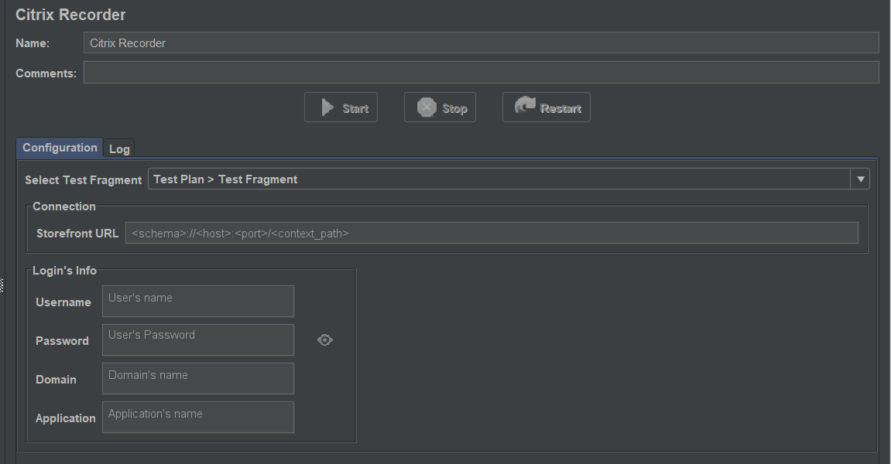
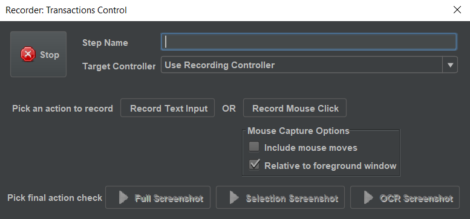
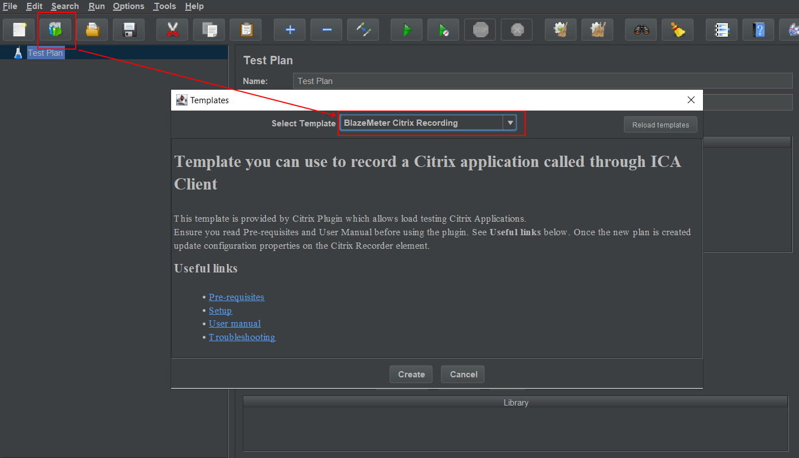
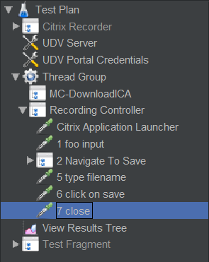
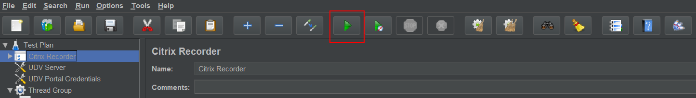
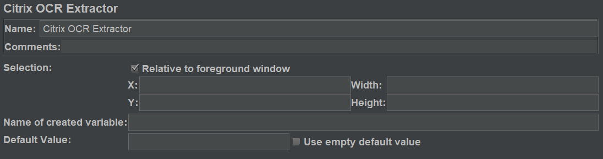

## User Manual

### Getting Started

#### Use template BlazeMeter Citrix Recording

A Citrix Recording Template is available to ease the script creation.
Click on Files → Templates... and select **BlazeMeter Citrix Recording**.

The template will add below elements:

#### Connection information on Citrix Recorder

The first item in `Test Plan` is the `Citrix Recorder`.
In this place you can configure the access to the Citrix portal, as well as the necessary data to record the first application flow.

***Test Fragment section***

- The default template includes a fragment that is responsible for establishing communication with the portal and downloading the ICA file.
You should only use the selection of another fragment if it is necessary to implement your own method of connection to download ICA file.

***Connection section***

- **Storefront URL:** Type the full URL of the Citrix portal used.

***Login's info section***

- **Username and Password:** The user and password used to launch an application on the portal.

- **Domain:** If your portal use multiple domains to authenticate the user, put here the name of the domain listed on the portal.
If you don't have a domain listed on your portal, leave the field blank.

- **Application:** The name of the application. Write the name exactly as it is listed on your portal.

**Note:** 
Citrix over the years has released multiple portal technologies.
The plugin currently focuses on supporting `Citrix Storefront` 2.1 onward, and brings support for some versions of `Citrix Gateway` in experimental mode.
In case the plugin does not support your portal used, please contact us.

#### Start Recorder
Once the configuration is done, the **Start** button is enabled.
Click on the **Start** button. You will see in the **Recorder status** the progress.

Then your Citrix application will launch, you can view the HTTP download steps in the **View Results Tree** located under Test Plan

#### Recording Actions

Once your Citrix Application has launched, click on the **Application Started** button to tell the plugin that the Citrix Application
is ready to be used. 
You will see a screenshot of the Citrix Window, and you must then select to make a hash or ocr check (this will be discussed later).

You can in this popup choose an area and make a Image Hash or a Text recognition (OCR). 

It's important to select a meaningful area to check that is stable across time.
Once you validate, check your `Test Plan / Step` view and notice you generated the corresponding sampler and step. 

The sampler generated by the **Application started** button is named **Citrix Application Launcher**, it's the only one that does not take the step name into consideration.
This sampler also contains the End Clause that is the result of the check you chose and configured:

From this moment, it is possible to indicate which actions are to be recorded.
You will have the action recording panel called Transactions Control available at all times.

The recording of actions is not a live recording, so you must plan and execute each action you want to record in steps.

You can name the step in the `Step Name` field.
You can also indicate where you want to store the action in the Test Plan usgin the `Target Controller` option.
By default, the provided `Recording Controller` section is selected in the Target Controller, but it is possible to create the structure you want to store the results in another place in order to organize the recorded action to your own interest.

From this point, you can use the **Record Text Input** and **Record Mouse Click** buttons :

**Record Text Input** allow you to record every text input on the Citrix Window while the button is activated. When you are done with the text recording,
just click again on the button, and the associated samplers will be added in the JMeter tree and in the **View Results Tree** under **Citrix Recorder**.
If there are many Interactions, they will be grouped under a **Transaction Controller**. 
You can also choose to use one of the three following buttons to stop the text input capture : 

* **Full Screenshot Check** adds to the created sampler a hash of the entire Citrix Window that will be analyzed during sampling process.
* **Selection Screenshot Check** pops up a window with a screenshot of your Citrix Application. You can select an area of the screenshot that will be hashed and passed to the created sampler.
* **OCR Screenshot Check** works the same as the previous one but instead of hash, it is the text recognized by the OCR engine in the selected area that will be passed to the created sampler.

**Record Mouse Click** records mouse clicks. It works exactly like its **Record Text Input** counterpart. 
You can click again on it to stop the capture or use one of the three others buttons mentioned previously. 

One **Record Mouse Click** sequence will end in **one sampler per click created** on the JMeter test plan and in the **View Results Tree** under **Citrix Recorder**. If you checked the **Include mouse moves** box, plugin will create between each click samplers a sampler with **Mouse move informations**.

When you're done with recording, you can end the recording by clicking on the **Stop** button. It will close your Citrix Application and close also the Citrix session. 
You can also choose to end the recording by closing yourself the Citrix application inside the Citrix Window or by closing the Citrix Window itself.

The Target Controller is a controller in your JMeter testPlan where the created samplers will be added during the recording.

---

### Recording Example

Here we will make a recording on the Notepad application. We want to record the following sequences :

* The start of the Citrix window and Notepad application inside citrix
* Input text -> Foo
* Clicks that lead us to the save dialog
* Input text > test (name of the file to save)
* Click on save
* Click on X (to close the Notepad)

To begin with, we create the template as described in the overview section:

Once it's done, go to the **Citrix Recorder**, unfold node and select **View Results Tree**, fill in **Filename** field/ 
I select in my case *D:\notepadRecord\recording-citrix.xml*

Click on **Start Recording** (don't forget to select the DownloadICA step like on the image above) and wait for the citrix app and Notepad to launch.

Once application is available and ready to be used:

Click on the **Application started** button:

You can in this popup choose an area and make a hash/text but you can also directly validate. 
You can do as you wish here, it doesn't affect the recording at all.
It's important to select a meaningful area to check that is stable accross time.
Once you validate, check your TestPlan/Step view and notice you generated the corresponding sampler and step. 

The sampler generated by the **Application started** button is named **Citrix Application Launcher**, it's the only one that does not take the step name into consideration.
This sampler also contains the End Clause that is the result of the check you chose and configured:

Now we want to record the "Foo" text input we will type on the Notepad. Change the step name to *foo input*, click on **Record Text Input** 
and type foo in Notepad. 

**Note:** You can make clicks on the Notepad application to gain the focus, but it won't be recorded since **you only record text input**. 
When you end typing foo, click again on the text input button.

Now you have a second step in the step view and a second sampler in your plan. The generated sampler should looks like this:

Go back to the Citrix Recorder, type *Navigate To Save* in **Step name** and click on the **Record Mouse Click button**. 
Go to your Notepad app, click on *File* > click on *Save as*, go to the **Citrix Recorder** and click on the mouse click button.

**Note:** The action create one step and 2 samplers inside a **Transaction Controller**.

The generated samplers have the same click coordinates that the one in the step informations.

The following sequences until the end of the recording work the same way. The last sequence correspond to a click on "X" of the notepad app. When you do that, you also close the citrix client and a popup appears:

If you click on save, you will create the sampler and the step which closed the citrix application. 
A step created this way has no screenshot since this is the step that closed the application. 

With this example you should have something looking like this :

Enhance then your test plan with the **Citrix Assertions** and **Citrix Session State Assertion** required to have the expected states.

---

### Playback (Debug the recorded session)

When you have finished recording all actions, it is time to test the recorded session.

Now you can press the **Start** button on the JMeter toolbar, and you can see the application running.

**Note:** To make sure you start with clean data in the `View Results Tree`, select `Clear` or `Clear All` button on the JMeter toolbar

As each action is performed, and the `End Clause` is evaluated, the result will be recorded in the `View Results Tree` element.

#### Understanding the result

When performed the playback of the recording session, the results of the execution is displayed in the listener `View Results Tree`.

When you select a item from the list, you can view the `Sampler result`, in that place you can see the error codes or error messages when they occur, or other data such as Load time.

If it is a Citrix sampler, it is possible to see the actions performed on the `Request` and `Request body` tab.

If you select the `Respond data` and `Response body` tab, you will be able to see the screenshot made in that action.

#### Debug the result with Citrix Interaction

The Citrix plugin provides a renderer named `Citrix Interaction` that allows you to view the Citrix screenshot, and the rule area defined in the `End Clause` to evaluate.

To use it, select it in **View Results Tree**, open the combo list with default value `Text` and select `Citrix Interaction`:

Then you can select a Sampler with an End Clause assertion to view the definition over the image captured.

At the top, you can see the `Relative to foreground window` option, which will be outlined in red on the foreground window evaluated.
You can also view the coordinates of the area to be evaluated on the `Selection` section, which is painted in a green box inside the focused window.
            

`Citrix Interaction` allow interaction to debug and refine selections.
You can use the mouse to select a new area, evaluate the image `Hash` or the `Text` with image recognition.
If you take notes of the coordinates, you can translate that values in a miss configured `End Clause` to fix it.

Additionally, `Citrix Interaction` allows you to create new `Citrix Assertion` if you select the area, evaluate the text and drag the `Drag CreatedAssertion` option to the `Recorder Controller` tree to create the element.

---
### Configure Test Plan for Load Simulation

Now it is time to make the necessary configuration to be able to do a load simulation.

Citrix generally does not allow the same user to simultaneously run the same application.

Generally, what is simulated is the entry of multiple users, assigning one user per thread and in each thread executing the application under test.

In JMeter, the easiest way to do this is to provide the user data using a `CSV Data Set Config`.

Go to the Test Plan and add a `CSV Data Set Config` from `Config Element` group.

Then, you must configure the reading of the csv file as indicated below.

**Filename:** The file name to the csv. It is recommended to use a name relative to the project so that the file is locatable when it runs distributed.

**Variable Names:** The variable names used by the csv file, for this example, citrix_login, citrix_password, but also is possible to set citrix_domain when the authentication needs that.

**Note:** If you need more speific variables to use, all the variables are defined on the `UDV Server` and `UDV Portal Credentials` created by the template inside the `Test Plan`.
You can also control the portal and the application to use on each iteration if you need more advances usage.

**Delimiter:** The delimiter used on the csv file, on the example, use the comma character.

**Allowed quoted data:** When the data use quotes

**Recycle on EOF?:** When `End Of File` is reached, start again to read again from the beginning.

**Stop Thread on EOF?:** When you need to stop the thread when `End Of File` is reached.

**Sharing mode:** All threads, this data is important because the plugin need to run a different user on each thread. That preference split the data between all the threads ensuring not replicate the same data on others threads.

When the CSV is created, and the data it's populated, you can now configure the `Thread Group`.

Select `Thread Group` inside the `Test Plan`.

By default, the template configure the execution to `Stop Thread` when error occurs on sampler.
For most cases, this is a good initial setup.
The `Continue` on error setting *is the most discouraged setting*. This option should only be indicated if the error control of each action is implemented in the JMeter logic.
The rest of the options also have implications, only use it when you have more advanced knowledge of JMeter.

On the `Thread Properties`, you can setup how the load simulation will behave.

The simplest way to start is by increasing the number of threads which will be equivalent to the number of users. After they achieve an iteration with concurrency, you can increase the iterations.

In an interactive execution, it is recommended not to simulate more than 10 concurrent users due to limitations in Citrix Workspace/Receiver.

Load testing scalability with Citrix requires more advanced knowledge.
Since scalability is done horizontally, advanced knowledge of test infrastructure and orchestration is required.

In case you need to perform a simulation of hundreds or thousands of Citrix users, do not hesitate to consult us.

### Saving the execution inside the View Results Tree

To save a Citrix Recording, the Template comes with a **View Results Tree** located under **Citrix Recorder**.

Just modify the **Filename** of the output file and recording will be saved in the XML file and be reloadable on demand in it as with regular HTTP Recording.

**Note:** If you add one yourself, ensure you click on **Configure** button and check all fields except *Save Field Names (CSV)*

This file can be saved if you want to store the evidence of the execution or the recording. These files can be very useful when analyzing what has been done.

Also, is the same thing for the `View Results Tree` located at the bottom of `Thread Group`, used for recording the playback execution.

---

### Recording custom Test Fragment for Download ICA

If the template doesn't work for you as there might be some variations between portal versions, you should then use JMeter HTTP(S) Test Script Recorder to record the steps that lead to the download of the ICA. 
For more details, read [this](https://jmeter.apache.org/usermanual/jmeter_proxy_step_by_step.html) which explains how to make HTTP(S) recording.

To make it work you need to:

* Ensure that you do the required correlation for the **CsrfToken** token.
* Add **ICA File Saver** to the ICA download step

---

## Important tips on Test building/sampling

#### Plan before recording
Make sure you have a well-defined business process planned and run it before recording it to JMeter.
You can save a lot of time because a simple mistake during recording could cause you to start over from the beginning.

#### Ensure a clean session
When recording a session, make sure to perform the complete business process, starting with the connection and ending with the cleanup. 
End your session at a point from where you could start the entire process from the beginning. 
Do not leave any client or application windows open. 

#### Use explicit clicks
When opening expanded menu options, click explicitly on each option, do not depend on the expanding menu. 
For example, when choosing **Start** > **All Programs** > **Mozilla Firefox**, be sure to click on the line All Programs.

#### Do not resize windows
To ensure exact reproduction of recorded actions, avoid moving or resizing windows while recording.

#### Add timers when needed

You must make sure to wait long enough between sampler actions during process:

- First to reproduce user think time
- Second to reproduce the time when user inputs text or do a mouse move

To add a static duration between samplers: 

* add a Think Time (Flow Control Action with a JMeter Uniform Random Timer as a child) between your samplers

#### Adjust end-clause timeout when needed

For some actions that might take a long time, ensure you set a big enough timeout:

* Adjust the timeout in end-clause on a Citrix Sampler if this sampler must make a zone hash/OCR

## Limitations

#### Inconsistency with ongoing Citrix sessions
Due to a limitation of the Citrix receiver, this plug-in does not support sessions already in progress. In this case, the Citrix client does not send any events and the plug-in cannot synchronize with it either for registration or sampling.

Please **make sure to always run new Citrix sessions**.

#### No screenshot during sampling
Due to a limitation with the Citrix Receiver handling, the samplers that use the following check types do not create screenshot:

* Window Closed
* Window Gets Foreground

#### Foreground window inconsistency
Due to limitation of the Citrix receiver, avoid minimizing any application windows when you want to use the "Relative to foreground" checks because the detection of the foreground area then becomes inconsistent.

#### Text interpretation of keystrokes
The Citrix plugin analyzes typing usage and key combination usage for special keys at recording time.
It automatically creates samples of type Text or of type KeySequence if they are special keys.
If there is any key combination that is not captured, feel free to let us know.

---

## Citrix JMeter elements

The elements created by the recording process are documented below, as well the elements that you can use to carry out more advanced actions.

#### Samplers
In this section we will cover the 2 samplers this plugin adds to JMeter.

#### Citrix Application Launcher

This sampler is added when you click on the **Application Started** button of the Citrix Recorder.

**ICA file path variable** contains the name of the variable (defaults to *citrix_ica_file*) that contains the path where the ica file is saved. 

If you use the template you can see it in Test Fragment -> DownloadICA -> ClickApp -> ClickApp-0 -> **ICA File Saver**. 
See below for **ICA File Saver** documentation.

**Timeout** field is computed by the **Citrix Recorder** and is the time between the launch of the citrix window and the moment the user clicks on the "Application Started" button. 
During sampling, it will be used as the maximum time to wait for application to start.

The End Clause panel will be explained in the **Citrix Interaction** section.

#### Citrix Interaction

The **Interaction Informations** panel contains instructions that will be sent to Citrix.

There are 4 different interaction types. On the above picture you can see the **Input Text** one.
The 4 interaction types are:

* **Input Text** : contains text you typed during the recording of a text input capture. **Note:** That letters are always displayed as uppercase.
* **Key Sequence** : contains informations about control keys that are not letters or numbers (e.g shift, ctrl, alt buttons).
* **Mouse Click** : contains coordinates of one mouse click you made during a mouse click capture.
* **Mouse Sequence** : contains coordinates of your mouse while it was moving if you activated **Include mouse moves** during the recording.

**End Clause panel** :

This tells the Sampler that the expected state has been reached. For example, assume you have a sampler at a state where your application displays "Hello World !". The selection zone is the rectangular area you want to check, with our example you would put the "Hello World !" coordinates in your app.

**Check Type**: 

* **HASH** makes a hash of the selected area (makes a hash of the full screenshot if there are no coordinates in the selected area).
* **OCR** detects the text in the selected area.
* **HASH Changed** detects whether content of the selected area changes using hash computation.
* **OCR Changed** detects whether content of the selected area changes using text recognition.
* **Session Closed** detects whether the Citrix session is closed.
* **Window Exists** ensures a window with an expected title is present in Citrix session. 
* **Window Closed** ensures a window with an expected title is closed during the check.
* **Window Gets Foreground** ensures a window with an expected title gets the foreground during the check.
* **None** makes nothing, which means Sampler will run the interaction and consider result as OK.

**Selection Zone**:

* **Relative to foreground window**, check this option if you want the coordinates below to be relative to the foreground window during sampling.
* **X, Y, Width and Height** specify the screen area where the check is performed during sampling.

**Expected value**:

* **Use regular expression**, check this option if you want to use regular expression pattern matching instead of text equality.
* The textarea contains the expected value depending to the check you want to perform :
    * **HASH**, the hash value of the selected area.
    * **OCR**, the text contained in the selected area.
    * **Window Exists**, the title of the window that must be present.
    * **Window Closed**, the title of the window that must be closed during the check.
    * **Window Gets Foreground**, the title of the window that must get the foreground during the check. 

**Timeout**: The maximum time during which the end clause must be honored.

If the end clause state of the sampler is different from the one retrieved in the same area during the recording, the sampler will retry until timeout is reached. If timeout is exceeded and expected state is not reached, the sampler will be in failed state.

#### Assertions

##### Citrix Session State Assertion 

This one is very simple. Place it under a **Citrix Interaction** or **Citrix Application Launcher** sampler. 
It checks if the citrix session is open or closed. 
Just select one of the 2 options.

##### Citrix Assertion

It must be placed in the scope of **Citrix Interaction**/**Citrix Application Launcher** samplers. 
You can notice it is very similar to the **End Clause** panel of the samplers.

There are 3 differences:

* The sampler in its scope must have already completed the end clause or timed out. Otherwise it would not take a screenshot on which the assertion works.
* You can't use the "None" check type (would mean the assertion does nothing).
* You can only use "HASH" or "OCR" because only these can work on a single screenshot .

After sampler has executed, the assertion compares the expected hashes/texts (separated by **|**) in the selected area with what it finds in the screenshot. 
If none matches, the sampler in scope is marked as failed.

*Note:* You should almost never create an assertion by yourself. There is the **Citrix Interaction** renderer in **View Results Tree** 
that helps you generate them from sampling or Recording steps.
Click on any screenshot of the recorded steps. Select a rectangle and click on "Get hash" or "Get text".

If you want to create assertion for this rectangle, drag from the **Drag Created Assertion** and drop under one of your samplers in the test plan.

#### Listeners

The plugin adds a **Listener** to JMeter called **ICA File Saver**. 
This listener must be added as a child of the **HTTP Request** that downloads the ICA file.

The configuration of this element is very simple:

* **ICA file path variable** is the name of the variable that contains the path to the ICA file downloaded for 1 thread. It defaults to **citrix_ica_file**. **Note:** This variable name must be the same as the one defined in the **Citrix Application Launcher** element.
* **ICA files folder** is the folder where ICA files for all users are downloaded. You should cleanup this folder when starting a test

#### Post Processors

##### Citrix Assessment Extractor

This extractor extracts the value measured by the **end clause**. The value is set to a variable and if there is no value measured, a default value can be set.

##### Citrix OCR Extractor

This one extracts a string from the screenshot with the OCR technology (it reads the text inside the selected zone) and stores it into a variable which is reusable.

