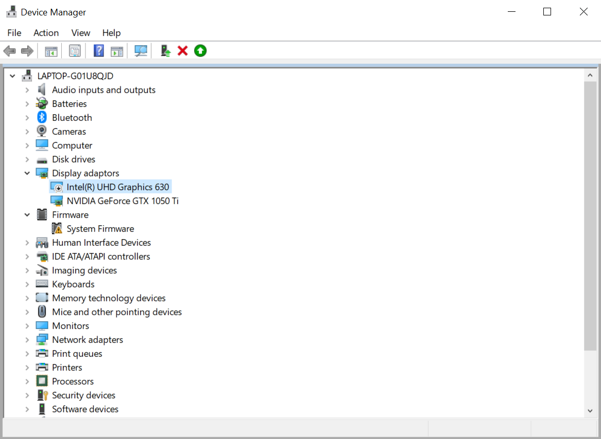

# JMeter Citrix Plugin setup

## 1. Apache JMeter pre-requisites

* Install a **JDK 8 Windows x86** (not 64 bits !) in last minor update from [here](https://www.oracle.com/technetwork/java/javase/downloads/jdk8-downloads-2133151.html)
* Install Apache JMeter from [here](https://jmeter.apache.org/download_jmeter.cgi). Last version is advised (>=5.1)

## 2. Citrix pre-requisites

* Ensure that you are working with supported versions of your Citrix client and server. If you don't have
yet Citrix receiver, install it from [here](https://www.citrix.com/downloads/citrix-receiver/windows/receiver-for-windows-latest.html) 

* Once installed, start JMeter as **as administrator**, see below, it will automatically run required installation steps.
If you encounter any errors, please check below points manually.

### Citrix pre-requisites to check **only if automatic installation fails**:

* **Ensure you run below commands as Administrator**

* Once Citrix Receiver is installed, register ICA Client COM Object, run **as administrator** : 

    regsvr32 C:\Program Files (x86)\Citrix\ICA Client\wfica.ocx
   
* Add registry keys :
    
   You can click on setup/setup-x86.reg or setup/setup-x64.reg to add the below keys:

    * For Windows 32bits: 
        * Location: HKEY_LOCAL_MACHINE\Software\Citrix\ICA Client\CCM 
        * Name: AllowSimulationAPI 
        * Type: REG_DWORD 
        * Data: 1
        
        * Location: HKEY_LOCAL_MACHINE\SOFTWARE\Citrix\ICA Client\ 
        * Name: VdLoadUnLoadTimeOut
        * Type: REG_DWORD 
        * Data: 30
        
    * For Windows 64bits:
        * Location: HKEY_LOCAL_MACHINE\SOFTWARE\Wow6432Node\Citrix\ICA Client\CCM
        * Name: AllowSimulationAPI 
        * Type: REG_DWORD 
        * Data: 1
        
        * Location: HKEY_LOCAL_MACHINE\SOFTWARE\Wow6432node\Citrix\ICA Client 
        * Name: VdLoadUnLoadTimeOut
        * Type: REG_DWORD 
        * Data: 30 (Value in seconds (Decimal))

   The second key VdLoadUnLoadTimeOut is needed to workaround an issue that manifests as :
   
      "You might be having an issue with a Citrix virtual driver (SmartCard). Contact your system administrator for further assistance":

   See
   
- https://support.citrix.com/article/CTX133536

---

## 3. Install Plugin

#### From JMeter-Plugins (Advised way, NOT AVAILABLE YET until plugin is published)

* Install plugins-manager from [here](https://jmeter-plugins.org/install/Install/)
* Start it and search for Citrix then install

#### From archive (Installation through jmeter-plugins is advised)

* Uncompress jmeter-citrix-plugin archive
* Copy citrix-jmeter-<version>.jar in JMETER_HOME/lib/ext 

    Since version 1.0, the plugin provides an installer which checks and sets up the next step. If you encounter any errors, please check this point manually.

* Edit jmeter/bin/saveservices.properties and add at the end of file

        # Add the following line at the end of JMeter saveservice.properties file
        _com.blazemeter.jmeter.citrix.sampler.CitrixSampleResultConverter=collection

## 4. Run JMeter 
Run your JMeter installation by going to jmeter/bin folder and launching jmeter or jmeterw.

---

### 4.1 Plugin Properties

You can adjust plugin properties by adding an entry in JMeter file located in jmeter/bin/user.properties.

Here is the list of configurable properties,  **non bold** properties should be ok in all case, you may want to adjust the **bold** ones :

| Property name                                 | Description                                                                                                   | Default Value                                                 |
|--------------------------------------------   |------------------------------------------------------------------------------------------------------------   |------------------------------------------------------------   |
| bzm.citrix.clause_check_interval              | Interval for the timing of clause checks                                                                      | 1000 (in millis)                                              |
| bzm.citrix.clause_check_timeout               | Default time period (in ms) during which a clause must be validated                                                   | 3000 (in millis)                                              |
| bzm.citrix.clause_check_max_results           | Maximum number of check results kept in the responseMessage                                                   | 20                                                            |
| bzm.citrix.connect_timeout                    | Time (in millis) during which a Citrix session must send a CONNECT event (maximum application launch time)    | 5000 (in millis)                                              |
| **bzm.citrix.default_recording_import_path**      | Directory used to decompress during import recording                                                          | <JMeterHome>/citrix-recordings/<folder with date and time>    |
| bzm.citrix.ica_downloading_ignore_backends    | Allows you to ignore the BackendListeners present in the plan during ICA download                             | true                                                          |
| bzm.citrix.ica_downloading_ignore_timers      | Allows you to ignore timers present in the test plan during ICA download                                      | true                                                          |
| bzm.citrix.ica_file_path_var                  | Refers to the variable used to retrieve the ICA path by the ICA File Saver                                    | citrix_ica_file_path                                          |
| **bzm.citrix.ica_recording_folder**               | Default recording folder                                                                                      | <JMeterHome>/citrix_recording                                 |
| **bzm.citrix.ica_files_folder**                   | Property used to set default value for **ICA File Saver** element. This value will be used as Folder where ICA files are downloaded.                                                                         | <JMeterHome>/ica_files                                        |
| **bzm.citrix.selection_color**                    | Color of the selection mask expressed as R,G,B                                                           | 0,255,0 which is Green                                        |

---

## 5. Important tips on Test building/sampling

#### Plan before recording
Make sure you have a well-defined business process planned, and run through it before recording it in JMeter.
It can save you a lot of time because a simple error during the record could make you start again from the begin.

#### Ensure a clean session
When recording a session, make sure to perform the complete business process, starting with the connection and ending with the cleanup. 
End your session at a point from where you could start the entire process from the beginning. 
Do not leave any client or application windows open. 

#### Use explicit clicks
When opening expanded menu options, click explicitly on each option, do not depend on the expanding menu. 
For example, when choosing **Start** > **All Programs** > **Mozilla Firefox**, be sure to click on the line All Programs.

#### Do not resize windows
To ensure exact reproduction of recorded actions, avoid moving or resizing windows while recording.

#### Add timers when needed

You must make sure to wait long enough between sampler actions during process:

- First to reproduce user think time
- Second to reproduce the time when user inputs text or do a mouse move

To add a static duration between samplers: 

* add a Think Time (Flow Control Action with a JMeter Uniform Random Timer as a child) between your samplers

#### Adjust end-clause timeout when needed

For some actions that might take a long time, ensure you set a big enough timeout:

* Adjust the timeout in end-clause on a Citrix Sampler if this sampler must make a zone hash/OCR

---

## 6. Important tips on Test environment and setup

#### Ensure consistency between machines
If you intend to replay the script on another machine which will be the case for Blazemeter, make sure that the following items are consistent between the record and Blazemeter replay machines: 

- Window Size (resolution), 
- Window Colors and color depth, 
- System Font, 
- ClearType, 
- and the other Default Options settings for the Citrix client. 

**These settings affect the hash values**, and **inconsistencies may cause sampling to fail**. 

To view the Citrix client settings, right-click an item from the Citrix program group and select Application Set Settings or Custom Connection Settings. 
(Note that the remote session on the Citrix server inherits the ClearType settings of the local machine.)

Display settings of 1024 x 768 are recommended.

Alternatively, you can use the following JMeter parameters to try to set display settings of the Citrix session (See citrix.properties file for futher information):

* bzm.citrix.client_factory.client_property.horizontal_resolution 
* bzm.citrix.client_factory.client_property.vertical_resolution
* bzm.citrix.client_factory.client_property.color_depth

Keep in mind that Citrix server settings have precedence on the above parameters.

#### Windows Style
 
Record all windows in the "classic" windows style—not the XP style. This is relevant when using Hash. 

To change the Windows style to "classic": 

* Click in the desktop area. 
* Choose Properties from the right-click menu. 
* Select the Theme tab
* Choose Windows Classic from the Theme drop down list. 
* Click OK. 

#### Avoid production environments if possible
Try to load test Citrix applications which are restricted to a few Citrix servers in a Citrix development or test environment rather than load testing in a live Citrix production environment.

#### Prevent automatic citrix session start

Close all instances of the **concentr.exe** process for all users. 
To prevent the Citrix Connection Center from starting automatically, set the ConnectionCenter registry key to an empty value. 
This key can be found at:

     * 32-bit systems: HKEY_LOCAL_MACHINE\SOFTWARE\Microsoft\Windows\CurrentVersion\Run
     * 64-bit systems: HKEY_LOCAL_MACHINE\SOFTWARE\Wow6432Node\Microsoft\Windows\Curr

#### Citrix Receiver Security Warning
The Citrix client may prompt you with a warning "An online application is attempting to access files in your computer". This dialog box blocks the replay because it requires user intervention.
Workaround: To prevent this, configure the registry on the Citrix client machine to allow it to silently access local drives, as described [here](http://support.citrix.com/article/CTX124921).

#### Security Software
If possible, disable anti-malware and other security or antivirus software. Alternatively, add an exception to ignore JMeter process and ICA Client receiver.

#### Disable the desktop toolbar
The Citrix administrator should disable the desktop toolbar. 
There are several ways to do this: 

- Add to the default.ica file:

    ConnectionBar=0 
 
- Follow the method described in: 

   -https://support.citrix.com/article/CTX138928. (Relevant only for published desktops, not published applications).

#### Session Disconnect

By default, when a client times out or disconnects from the Citrix server, the session remains open for a defined time period. 
However, beginning a run in a Citrix session that has an unpredictable state can cause your test to fail.
Therefore, the Citrix server administrator should configure the Citrix server to end (reset) the client session when a client disconnects for any reason.

#### Multi-Session Support

If you are going to run more than one Citrix Session on JMeter, ensure that the Citrix server is configured to enable multiple sessions per user/client.

---

## 7. Commons issues / Limitations

####Inconsistency with ongoing Citrix sessions####
Due to a limitation of the Citrix receiver, this plug-in does not support sessions already in progress. In this case, the Citrix client does not send any events and the plug-in cannot synchronize with it either for registration or sampling.

Please **make sure to always run new Citrix sessions**.

####No screenshot during sampling####
Due to a limitation with the Citrix Receiver handling, the samplers that use the following check types do not create screenshot:

* Window Closed
* Window Gets Foreground

#### Black screenshots

If you get black screenshots while recording, check you graphical card. 
**If you have more than one, deactivate one of them.**

#### Failed to get session from client

If you get this error, Make sure the AllowSimulationAPI key is present in the above registry and not set to 0, as it enables Citrix ICO functionality. Note that in 64-bit operating systems, these keys should reside under the HKLM\Software\Wow6432Node, node, since the Citrix client is a 32-bit application.  

####Foreground window inconsistency####
Due to limitation of the Citrix receiver, avoid minimizing any application windows when you want to use the "Relative to foreground" checks because the detection of the foreground area then becomes inconsistent.

####Text interpretation of keystrokes####
Only the following keys on the keyboard are interpreted as text:

* A to Z
* 0 to 9
* Space

The use of any other key or modifier results in the generation of a "Key Sequence" sampler rather than a "Text" sampler.

#### Citrix Error 13 "Unsupported Function"

The Citrix Error 13 is a general error code that usually refers to an error for which Citrix do not provide a specific code. 

This error has multiple causes, check the following possible causes:

- The User Account Control (UAC) feature of Windows is not fully disabled and prevents the launching of the Citrix client.
- Another reason for the problem could be when there are Citrix processes (wfica32.exe, wfcrun32.exe, concentr.exe, receiver.exe) already running in other sessions than JMeter session

Fully disable the UAC with registry key:

     Location : HKEY_LOCAL_MACHINE\Software\Microsoft\Windows\CurrentVersion\Policies\System\ 
     Name: EnableLUA
     Data: 0

Note that the change requires a restart of the computer!

Use Windows Tasks Manager to kill all running processes: 
- wfica32.exe, 
- wfcrun32.exe, 
- concentr.exe, 
- receiver.exe before starting the load test.

Make sure to log out all the users before running the test in JMeter.
If any one of the either logged in or disconnected, there their user session is already running which in turns runs the processes (wfica32.exe, wfcrun32.exe, concentr.exe, receiver.exe) causing a clash between JMeter's triggered sessions

#### Virtual Machine
If running JMeter on virtual machines, check that you're dedicating memory and processes. This is a general recommendation and not Citrix specific.

#### Common issues

##### Error code 0x80070005
Getting error 

     The module C:\Program Files (x86)\Citrix\ICA Client\wfica.ocx was loaded but the call to DLLRegisterServer failed with error code 0x80070005

Ensure you run the regsvr32 and registry updates as Administrator as per:

- https://techjourney.net/the-call-to-dllregisterserver-failed-with-error-code-0x80004005-on-windows/
- https://social.technet.microsoft.com/Forums/windows/en-US/71037d62-d842-44a3-86df-6ed74df6fc39/0x80070005-error-trying-to-register-dll?forum=itprovistasecurity

##### Citrix user not logged before ...
At execution of a "Citrix Application launcher" sampler, getting error

    Citrix user not logged before ...

Means the Citrix Client does not signal the user is logged before the **Logon Timeout** set in the sampler.
First ensure the downloaded ICA file run a new Citrix session because Citrix client does not send any event when running a session already in progress.
Then you can increase the **Logon Timeout** setting.

##### Citrix user not logged before ...
At execution of a "Citrix Application launcher" sampler, getting error

    Citrix user not logged before ...

Means the Citrix Client does not signal the user is logged before the **Logon Timeout** set in the sampler.
First ensure the downloaded ICA file run a new Citrix session because Citrix client does not send any event when running a session already in progress.
Then you can increase the **Logon Timeout** setting.

##### Foreground window area must be defined while obtaining the absolute position of a relative selection.

If you get this message at execution of a "Citrix Application launcher" sampler, getting error

    Foreground window area must be defined while obtaining the absolute position of a relative selection.

This means the **Timeout** of **End Clause** is too short. 
Then you can increase the **Timeout** setting of **End Clause** (not the **Logon Timeout** of **Citrix Application Launcher**).
