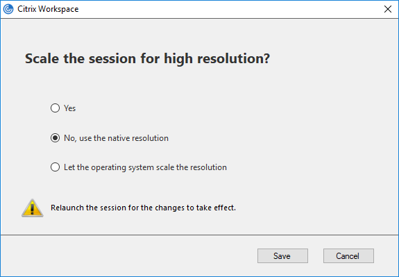

# Troubleshooting

In this section you will find information on how to solve the most common problems.

---

## Failed to get session from client

The error occurs when it is not possible to start a recording or session execution

#### Solution

Make sure the AllowSimulationAPI key is present in the above registry and not set to 0, as it enables Citrix ICO functionality. 

Windows 32bits:

    Location : HKEY_LOCAL_MACHINE\SOFTWARE\Citrix\ICA Client\CCM
    Name : AllowSimulationAPI
    Data : dword:00000001

Windows 64bits:

    Location : HKEY_LOCAL_MACHINE\SOFTWARE\Wow6432Node\Citrix\ICA Client\CCM
    Name : AllowSimulationAPI
    Data : dword:00000001

---

## Black screenshots

Citrix Receiver uses the Windows Manager to capture screenshots of running sessions.
Some video card drivers do not support the capture method used by Citrix.
When that case occurs, the screenshot appears black.

#### Solution

Option 1: Update the display graphics card drivers.

Option 2: Disabling the main graphics card driver not supported.

Disabling the graphics card driver will enable the Microsoft Windows compatible graphics driver, which is supported by Citrix Receiver.
The most common problematic drivers are those provided by Intel Graphics.

If you have an Intel driver listed, try disabling that driver first before others.

1) Go to Device Manager in Windows
2) select the category "Display adapters"
3) Disable the driver by right-clicking and selecting "Disable device"


---
## Citrix Application Launcher Errors

Some of the most common errors will be listed below, explaining the reason and what is its possible solution.

#### Solution

##### ICAFILE_TIMEOUT: Time out waiting for ICAFile
       
The error occurs at the time of the verification process of the ICA file against the Citrix server.

This can occur due to communication problems with the Citrix server or because it cannot respond in time. 

You can adjust the timeout by increasing the value of the [bzm.citrix.client_factory.client_property.icafile_timeout_ms](SETUP.md#plugin-properties) property

##### ICAFILE_ERROR: Failed to load ICAFile

The error occurs at the time of the verification process of the ICA file against the Citrix server.

When this error occurs, the ICA file provided to the server is not a valid ICA file.
Verify the correct operation of the file download cycle, and if the file provider and Citrix server is working correctly.

##### CONNECT_TIMEOUT: Timed out waiting for OnConnect

The error occurs when trying to create a new session against the Citrix server.

You can try increasing the timeout time by changing the [bzm.citrix.client_factory.client_property.connect_timeout_ms](SETUP.md#plugin-properties) property

Check at the Citrix server level if there is a problem where a new session cannot be created.

##### LOGON_TIMEOUT: Timed out waiting for Logon

The error occurs when the connection and session were established but the windows login event does not occur.

The Logon process may not occur for multiple possible reasons.

It is possible that due to overload the server is not managing to start a Windows session.

You can increase the timeout value by setting the [bzm.citrix.client_factory.client_property.logon_timeout_ms](SETUP.md#plugin-properties) property.

##### START_SESSION_ERROR: Unable to start session

This error is an unexpected error.

Contact the plugin support team.

---

## Citrix Error 13 "Unsupported Function"

The Citrix Error 13 is a general error code that usually refers to an error for which Citrix does not provide a specific code. 

#### Solution
This error has multiple causes, check the following possible causes:

- The User Account Control (UAC) feature of Windows is not fully disabled and prevents the launching of the Citrix client.
- Another reason for the problem could be when there are Citrix processes (wfica32.exe, wfcrun32.exe, concentr.exe, receiver.exe) already running in other sessions than JMeter session

Fully disable the UAC with registry key:
```
     Location : HKEY_LOCAL_MACHINE\Software\Microsoft\Windows\CurrentVersion\Policies\System\ 
     Name: EnableLUA
     Data: 0
```
**Note that the change requires a restart of the computer!**

Use Windows Task Manager to kill all these running processes: 
- wfica32.exe, 
- wfcrun32.exe, 
- concentr.exe, 
- receiver.exe before starting the load test.

Make sure to log out all the users before running the test in JMeter.

---

## Error code 0x80070005
Getting error 

     The module C:\Program Files (x86)\Citrix\ICA Client\wfica.ocx was loaded but the call to DLLRegisterServer failed with error code 0x80070005

#### Solution

Ensure you run the regsvr32 and registry updates as Administrator as per:

- https://techjourney.net/the-call-to-dllregisterserver-failed-with-error-code-0x80004005-on-windows/
- https://social.technet.microsoft.com/Forums/windows/en-US/71037d62-d842-44a3-86df-6ed74df6fc39/0x80070005-error-trying-to-register-dll?forum=itprovistasecurity

---

## Citrix user not logged before ...
At execution of a "Citrix Application launcher" sampler, getting error

    Citrix user not logged before ...

#### Solution

It means that the Citrix Client was unable to login in time.
First ensure the downloaded ICA file run a new Citrix session.
Then you can increase the **[Logon Timeout](SETUP.md#plugin-properties)** setting.

---

## Foreground window area must be defined while obtaining the absolute position of a relative selection.

If you get this message at execution of a "Citrix Application launcher" sampler, getting error

    Foreground window area must be defined while obtaining the absolute position of a relative selection.

#### Solution

This means the **Timeout** of **End Clause** is too short. 
Then you can increase the **Timeout** setting of **End Clause** (not the **Logon Timeout** of **Citrix Application Launcher**).

---

## Error 2312: The Citrix Receiver Received a Corrupt ICA File

If you get this message at execution

    Error 2312: The Citrix Receiver Received a Corrupt ICA File
    
#### Solution

Check you're using a version of Citrix Receiver compatible with plugin, see [System requirements and compatibility](PRE_REQUISITES.md#system-requirements-and-compatibility) 

---

## Citrix Receiver not start, "Error 70 cannot connect to server"

If you Citrix Receiver not start and in logs your get the error

    Error 70 cannot connect to server

#### Solution

This issue can be solved by clearing the citrix client cache and registry.

Step:

- Close all the citrix processes using Task Manager
- Uninstall Citrix Receiver
- Run regedit and delete:
     - Computer > HKEY_CURRENT_USER > Software>Citrix
     - Computer > HKEY_CURRENT_LOCAL_MACHINE > Software > WOW6432Node > Citrix > ICA Client
- If any of the below folders have ICAClient and/or Citrix folders, delete ICAClient and/or Citrix located in those folders:
    - C:\Users\USER RUNNING CITRIX\Application Data
    - C:\Users\USER RUNNING CITRIX\Local
    - C:\Users\USER RUNNING CITRIX\Roaming
- Reboot the machine
- Reinstall Receiver

---

## Popup when a Citrix Receiver update is available

By default, Citrix Receiver verify updates and notify you if a new version is available.
This behavior can affect the use of the test machine.

#### Solution

It is possible to disable the checking of new versions.

1. Right-click the Citrix Receiver for Windows icon in the notification area.
2. Select Advanced Preferences, and click Auto Update. The Citrix Receiver Updates dialog appears.
3. Select "No, don't notify me"

4. Click Save.

The option may not be available due to server policies or at installation time.
In those cases, it is possible to change the behavior by adding the following Windows registry values.

Open regedit.exe and set the following keys:

Windows 32bits:

    Location : HKEY_LOCAL_MACHINE\SOFTWARE\Citrix\ICA Client\AutoUpdate\Commandline Policy
    Name : Enable
    Data : "false"

    Location : HKEY_LOCAL_MACHINE\SOFTWARE\Citrix\ICA Client\AutoUpdate\Commandline Policy
    Name : Banned
    Data : "true"
    
Windows 64bits:

    Location : HKEY_LOCAL_MACHINE\SOFTWARE\WOW6432Node\Citrix\ICA Client\AutoUpdate\Commandline Policy
    Name : Enable
    Data : "false"

    Location : HKEY_LOCAL_MACHINE\SOFTWARE\WOW6432Node\Citrix\ICA Client\AutoUpdate\Commandline Policy
    Name : Banned
    Data : "true"

---

## High CPU usage on dwm.exe process

Citrix draws session windows using the system component called Desktop Window Manager (DWM)

Under high load, the component generates excessive CPU usage when rendering all the sessions at same time.

#### Solution

The Citrix plug-in does not require all the visual effects of Desktop Window Manager be enabled.
In order to allow a moderate use of resources without losing functionality, disable some visual effects features.

Under Windows run SystemPropertiesPerformance.exe program.
On the Visual Effects tab, select Custom option.
Just keep the option **"Smooth edges of screen fonts"** selected.


---

## Image Hash or OCR fails on different machine resolution

Depending on the scaling configuration indicated in the server policy, or the default configuration of Citrix Receiver, the sessions will be scaled to adapt to the resolution of the client machine.
This adaptation of the session images causes the final image of the session to vary according to each machine with a difference in resolution to the machine on which the session was recorded.
This can prevent the Hash and OCR algorithms from working as expected.

#### Solution

To configure DPI scaling on Citrix Receiver:

1. Right-click Citrix Receiver for Windows from the notification area.
2. Select Advanced Preferences and click DPI settings. 
The DPI settings dialog appears.
Change the settings to "No, use native resolution".

3. Click Save.
4. Restart the Citrix Receiver for Windows session for the changes to take effect.

In case you do not have access to that configuration screen, this is due to a policy indicated from the server.
It is possible to change the value of the configuration by changing a registry key.

Open regedit.exe and set the following key to disable dpi scaling:

    Location : HKEY_CURRENT_USER\Software\Citrix\ICA Client\DPI
    Name : Enable_DPI
    Data : dword:00000000

---

## OutOfMemoryError: Java heap space error

JMeter has a set of default settings that allow the application to run without memory problems in most cases.
However, under some circumstances, an `OutOfMemoryError` can occur.
When the error occurs, this indicates that the configuration should be changed to consider the current memory usage.


#### Solution

In general, the `OutOfMemoryError` is due to the design of JMeter components and how they store information in the application memory for display.

One of the main memory consumers are the `listeners`.

#### 1. First, let's allocate as much memory as possible for 32-bit Java.

Locate the directory where `jmeter.bat` is located and edit it with a text editor.

Add after the line `@echo` the following line:
```
set HEAP=-Xms1024M -Xmx1024M -XX:MaxMetaspaceSize=256M
```
This allocates as much memory as possible to JMeter for the future runs.

**Source:** [JMeter Wiki: JMeter keeps getting "Out of Memory" errors. What can I do?](https://cwiki.apache.org/confluence/display/JMETER/JMeterFAQ#JMeterFAQ-JMeterkeepsgetting%22OutofMemory%22errors.WhatcanIdo?)

#### 2. Set a proper limit for the View Result Tree listener.

Locate `user.properties` file and open them with a text editor.

Add the following line to the configuration:
```
view.results.tree.max_results = 80
``` 
View Result Tree by default shows the last 500 items on the screen.

This consumes memory and can cause long tests to end up with an `OutOfMemoryError`.

Depending on the type of test you are running, the amount of information that JMeter stores may exceed the available memory.

The recommended setting limits only the last 80 results to remain visible to ensure that all memory is not consumed.

You can try increasing the value until you find the one best suited for the type of test you are running.

**Source:** [JMeter View Results Tree documentation reference](https://jmeter.apache.org/usermanual/component_reference.html#View_Results_Tree)

#### Final notes

With the previous recommendations, in general, most of the problems with memory management in JMeter are solved.

In case they are not enough, there is also a good article available from BlazeMeter that tries to summarize other possible solutions to other possible causes of memory error.

[BlazeMeter: 9 Easy Solutions for a JMeter Load Test “Out of Memory” Failure](https://www.blazemeter.com/blog/9-easy-solutions-jmeter-load-test-%E2%80%9Cout-memory%E2%80%9D-failure)

In case you can't find a solution, don't forget to contact support.

